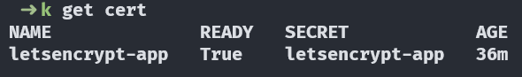
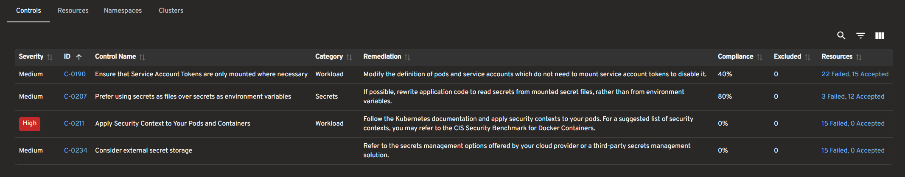
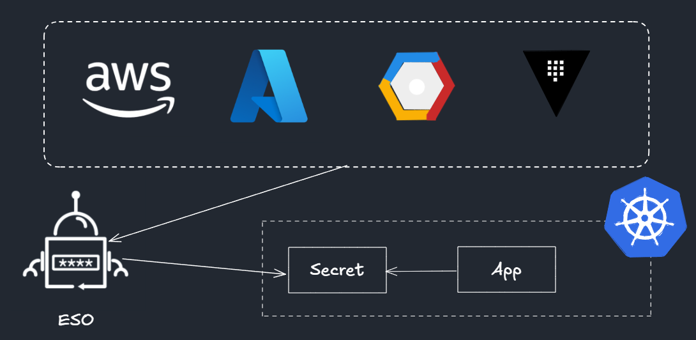
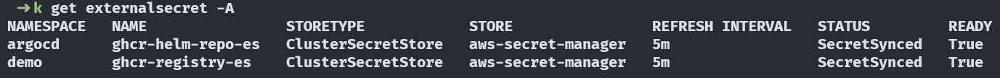

# ArgoCD

Repo git de configuration dédié : `portfolio-ultime-config`

## Diff Preview automatisé avec argocd-diff-preview

Pour stabiliser et fiabiliser les revues de changements ArgoCD sur les pull requests, le repo dédié utilise l'outil [argocd-diff-preview](https://github.com/dag-andersen/argocd-diff-preview).

- **Usage** : Le workflow GitHub Actions lance un diff ArgoCD sur chaque PR et poste le résultat en commentaire.
- **Avantage** : Permet d'ignorer les champs volatiles (ex: schedules et checksums générés aléatoirement) grâce à la variable `DIFF_IGNORE`, pour ne voir que les vrais changements applicatifs.
- **Configuration** : Voir `.github/workflows/argocd-diff-preview.yaml` pour l'intégration et les patterns ignorés.

> _Voir le commentaire automatique sur chaque PR pour le rendu du diff ArgoCD_

## Bootstrap ArgoCD

- Multi-sources utilisés dans les apps ArgoCD afin de référencer des values locales pour une chart helm distante

  > _Il faut éviter d'utiliser multi-sources pour d'autres cas de figure_

### ArgoCD - Déploiement

- Installation d'ArgoCD via chart Helm
- Déploiement des applications ArgoCD via la stratégie App-of-apps


### AWS Load Balancer Controller

#### Architecture de flux

`Client (Internet) → Internet Gateway (IGW) → ALB (L7) → Target Group (Pod IPs) → VPC Routing + Node ENI → Pod (dans le VPC)`

1. **Internet → ALB (Layer 7)**

- Un client externe envoie une requête HTTP/HTTPS.
- Le trafic entre par l’Internet Gateway (IGW), éventuellement via Route 53/DNS vers l’ALB.
- L’ALB termine la connexion TLS (si configurée) et effectue le routage applicatif.

2. **ALB → Target Groups (Pod IPs)**

- L’ALB cible directement les IPs des Pods enregistrées dans un Target Group (grâce au VPC CNI).
- Chaque Pod possède une IP VPC native, permettant un routage direct comme pour des instances EC2.

3. **Target Group → VPC / Node ENI**

- L’ALB envoie le trafic vers l’IP du Pod sélectionné.
- Le paquet traverse le réseau interne du VPC.
- Si le Pod est sur un Node, l’ENI du Node est utilisée pour délivrer le paquet.

4. **Node ENI → Pod**

- Le Node connaît le mapping entre l’IP du Pod et son espace réseau interne via l’ENI assignée.
- Le trafic est remis directement au Pod, sans passer par kube-proxy (routage L3 direct).

**Résultat :** latence faible, performance quasi native.

#### Values helm

- `defaultTargetType = "ip"` : Instance par défaut. Avec IP, Le trafic est directement routé vers les adresses IP des pods. La valeur IP est recommandée pour une meilleure intégration et performance avec la CNI Amazon VPC.
- `deregistration_delay = 120s` : Valeur fixe pour synchroniser la durée avec `terminationGracePeriodSeconds` du pod pour éviter les coupures de sessions pendant les déploiements
- `vpcTags` : Nom du cluster pour récupérer vpcID automatiquement


> _à configurer côté pod : terminationGracePeriodSeconds + ReadinessProbes_

### External DNS

Gestion automatique des enregistrements DNS Route 53

Annotation de l'ingress à ajouter pour créer une entrée de type A automatiquement :

```yaml
external-dns.alpha.kubernetes.io/hostname: app.ndebaa.com
```


### Cert Manager

Solver DNS-01 avec Route53 utilisé pour une meilleure intégration.

Avantages par rapport au solver HTTP-01 :

- ✅ Plus robuste : Pas de dépendance sur la résolution DNS interne du cluster
- ✅ Simplicité : cert-manager vérifie directement via l'API Route53
- ✅ Compatible avec l'infrastructure : external-dns avec permissions Route53
- ✅ Wildcards supportés si besoin
- ✅ Production-ready : Solution standard pour les clusters privés

Certificat cert-manager :



#### Cert Manager Sync

- **Projet** : [cert-manager-sync](https://github.com/robertlestak/cert-manager-sync)
- **Contexte** : ALB Controller n’utilise pas automatiquement les secrets TLS générés par cert-manager pour créer un listener HTTPS sur l’ALB car il attend un ARN ACM (annotation `alb.ingress.kubernetes.io/certificate-arn`)
- **Fonctionnement** :
  - Écoute les Issuers/Certificates cert-manager.
  - Crée automatiquement un certificat dans ACM.
  - Synchronise l’ARN ACM dans les annotations du Secret Kubernetes.


Annotation de l'ingress à ajouter pour transmettre un secretTemplate au Certificat auto-généré :

```yaml
cert-manager.io/secret-template: |
  {"annotations": {"cert-manager-sync.lestak.sh/sync-enabled":"true", "cert-manager-sync.lestak.sh/acm-enabled":"true", "cert-manager-sync.lestak.sh/acm-region": "eu-west-1"}}
```

Certificat ACM :


### CNPG (PostgreSQL)

Cluster PostgreSQL pour l'application todolist via l'opérateur CNPG (1 primaire et 1 secondaire)


### KubeScape (Test sécurité)

Outil open-source de sécurité et de conformité pour Kubernetes qui analyse les configurations, détecte les vulnérabilités et applique les bonnes pratiques dans les clusters et les manifests.

Dashboard utilisé : Headlamp (via plugin)

### Headlamp

Headlamp est une interface graphique moderne pour Kubernetes, facilitant la gestion et la visualisation des ressources du cluster. Dans ce projet, Headlamp est enrichi avec le plugin Kubescape, permettant d'intégrer directement les résultats d'analyse de sécurité et de conformité dans le dashboard. Grâce à ce plugin, il est possible de visualiser les rapports de scans Kubescape, d'identifier rapidement les vulnérabilités et de suivre l'état de conformité du cluster depuis une seule interface centralisée.

- Token d'accès nécessaire : `kubectl create token headlamp --namespace kube-system`
- Accès local : `kubectl port-forward -n kube-system service/headlamp 8080:80`

Compliance du framework cis-eks-t1.2.0 :



> [Doc in-cluster](https://headlamp.dev/docs/latest/installation/in-cluster/)

### secureCodeBox (DAST)

Outil d'analyse de sécurité automatisée (DAST) : secureCodeBox est un projet OWASP qui propose une solution open source automatisée et évolutive, intégrant plusieurs scanners de sécurité via une interface simple et légère — pour des tests de sécurité continus et automatisés.

#### Fonctionnement :

- Opérateur avec authentification s3 configurée
- Chart Helm `zap-automation-framework` installé dans le namespace de l'application à scanner
- Auto-Discovery avec scans automatisés + upload vers bucket S3.

Un scan va lancer 2 jobs :

- Job scan : Permet de générer zap-results.xml sur le bucket S3
- Job parse : Permet de générer findings.json sur le bucket S3 (format unifié et structuré de zap-results.xml)

#### Auto-Discovery

Pré-requis :

- Annotation sur le namespace demo `auto-discovery.securecodebox.io/enabled=true`
- Service nommé http/https pour la détection automatique

Values :

- `repeatInterval` : Le scan est déclenché immédiatement et le compteur de 168h (7 jours) est réinitialisé. Si aucun déploiement n'a lieu pendant 168h, le scan est déclenché automatiquement à l'expiration du délai.
- `env` : Supporte le templating si besoin

> _Nécessite un environnement dédié aux tests pour du scanning actif_

> _Documentation : [Auto-Discovery](https://www.securecodebox.io/docs/auto-discovery/service-auto-discovery/) / [default values](https://github.com/secureCodeBox/secureCodeBox/blob/main/auto-discovery/kubernetes/README.md)_

#### Test d'un scan manuel

```yaml
apiVersion: execution.securecodebox.io/v1
kind: Scan
metadata:
  name: zap-manual-test
  namespace: demo
spec:
  scanType: "zap-automation-framework"
  env:
    - name: TARGET_URL
      value: "http://todolist.demo.svc.cluster.local:5000"
  parameters:
    - "-autorun"
    - "/home/securecodebox/scb-automation/automation.yaml" # MountPath de la ConfigMap auto-générée (valeur par défaut)
  volumeMounts:
    - name: zap-config
      mountPath: /home/securecodebox/scb-automation/automation.yaml
      subPath: automation.yaml
  volumes:
    - name: zap-config
      configMap:
        name: zap-automation-framework-baseline-config # ConfigMap auto-générée
```

#### Rapports uploadé vers bucket S3


#### Résultat d'un rapport (Scanning DAST passif)


### External Secret Operator (ESO)

ESO permet de garder les secrets en dehors de git. L'opérateur surveille en continu les secrets afin de les synchroniser sur Kubernetes.

Fonctionnement :

- Récupère les secrets depuis un store (ex: AWS Secret Manager)
- Les convertit en secrets Kubernetes standard



Dans ce projet, le secret nécessaire se nomme `ghcr-token`. Il permet de récupérer les packages ghcr.io (Helm + Image Docker)



> _Note: Statut OutOfSync dans ArgoCD dû au paramètre refreshInterval, mais les secrets sont bien présents et fonctionnels_
