# Portfolio Ultime - Cluster EKS avec Terraform

## Table des matières

- [Portfolio Ultime - Cluster EKS avec Terraform](#portfolio-ultime---cluster-eks-avec-terraform)
  - [Table des matières](#table-des-matières)
  - [Pré-requis](#pré-requis)
  - [Structure du projet](#structure-du-projet)
  - [Cluster EKS complet](#cluster-eks-complet)
    - [Kubeconfig](#kubeconfig)
    - [Backend S3](#backend-s3)
    - [Infrastructure réseau (modules terraform-aws-vpc et terraform-aws-security-group)](#infrastructure-réseau-modules-terraform-aws-vpc-et-terraform-aws-security-group)
    - [Cluster EKS (module terraform-aws-eks)](#cluster-eks-module-terraform-aws-eks)
      - [Voir les schémas pour addons](#voir-les-schémas-pour-addons)
    - [Storage Class](#storage-class)
      - [Comparaison EBS vs EFS](#comparaison-ebs-vs-efs)
      - [StorageClass EBS (gp3) - Défaut](#storageclass-ebs-gp3---défaut)
      - [StorageClass EFS](#storageclass-efs)
    - [EKS Pod Identity (module terraform-aws-eks-pod-identity)](#eks-pod-identity-module-terraform-aws-eks-pod-identity)
  - [Bootstrap ArgoCD](#bootstrap-argocd)
    - [ArgoCD - Déploiement](#argocd---déploiement)
    - [AWS Load Balancer Controller](#aws-load-balancer-controller)
      - [Architecture de flux](#architecture-de-flux)
      - [Values helm](#values-helm)
    - [External DNS](#external-dns)
    - [Cert Manager](#cert-manager)
      - [Cert Manager Sync](#cert-manager-sync)
    - [CNPG (PostgreSQL)](#cnpg-postgresql)
    - [KubeScape (Test sécurité)](#kubescape-test-sécurité)
    - [Headlamp](#headlamp)
    - [secureCodeBox (DAST)](#securecodebox-dast)
      - [Fonctionnement :](#fonctionnement-)
      - [Auto-Discovery](#auto-discovery)
      - [Test d'un scan manuel](#test-dun-scan-manuel)
      - [Rapports uploadé vers bucket S3](#rapports-uploadé-vers-bucket-s3)
      - [Résultat d'un rapport (Scanning DAST passif)](#résultat-dun-rapport-scanning-dast-passif)
    - [External Secret Operator (ESO)](#external-secret-operator-eso)
  - [Pipeline dédiée à Terraform](#pipeline-dédiée-à-terraform)
  - [Licence](#licence)
  - [TODO](#todo)

Ce projet utilise GitHub Actions pour automatiser le déploiement d'une infrastructure via Terraform avec :

- Cluster EKS complet avec plusieurs modules
- ArgoCD avec boostrap d'applications

---

## Pré-requis

- Terraform >= 1.12.0
- AWS CLI configuré
- Repo git dédié pour ArgoCD : `portfolio-ultime-config`
- 2 Buckets S3 :

`portfolio-ultime-infra` (backend dédié à terraform pour le state)

```bash
aws s3api create-bucket \
  --bucket portfolio-ultime-infra \
  --region eu-west-3 \
  --create-bucket-configuration LocationConstraint=eu-west-3
```

`portfolio-ultime-securecodebox` (résultats des scans DAST)

```bash
aws s3api create-bucket \
  --bucket portfolio-ultime-securecodebox \
  --region eu-west-3 \
  --create-bucket-configuration LocationConstraint=eu-west-3
```

- Secret AWS pour autoriser à lire les packages ghcr.io

```bash
aws secretsmanager create-secret \
  --name "ghcr-token" \
  --description "Token Github avec permissions read packages" \
  --secret-string "GITHUB_TOKEN"
```

> _Pour supprimer un bucket S3 : `aws s3 rb s3://BUCKET_NAME --force`_

> _Pour supprimer un secret AWS : `aws secretsmanager delete-secret --secret-id ghcr-token --force-delete-without-recovery --region eu-west-3`_

- Secrets d'environnement GitHub :

| Secret                  | Description     |
| ----------------------- | --------------- |
| `AWS_ACCESS_KEY_ID`     | Clé d'accès AWS |
| `AWS_SECRET_ACCESS_KEY` | Clé secrète AWS |

- Terraform :
  - `allowed_ips` : Adresse IP personnelle en /32 (0.0.0.0/0 par défaut)
  - `external_dns_hosted_zone_arns` : Hosted Zone ID (Route53)
  - `external_secrets_secrets_manager_arns` : ARN du secret "ghcr-token" (Secret Manager)

---

## Structure du projet

```
portfolio-ultime-infra/
├── .github/workflows/
│   └── infra.yaml              # Pipeline CI/CD
├── terraform/
│   ├── eks.tf                  # Cluster EKS
│   ├── helm-charts.tf          # Charts Helm pour boostrap d'ArgoCD
│   ├── pod-identity.tf         # Pod Identity pour gestion des policies
│   ├── providers.tf            # Providers et configuration backend
│   ├── storage-class.tf        # StorageClass gp3
│   ├── variables.tf            # Variables
│   ├── vpc.tf                  # Configuration VPC + security groups
└── README.md
```

---

## Cluster EKS complet

### Kubeconfig

```bash
aws eks --region eu-west-3 update-kubeconfig --name eks-cluster
```

### Backend S3

Bucket S3 `portfolio-ultime-infra` avec `use_lockfile = true` (plus besoin de DynamoDB pour le verrouillage)

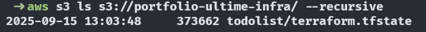

### Infrastructure réseau (modules terraform-aws-vpc et terraform-aws-security-group)

```bash
VPC (10.0.0.0/16) avec support DNS
├── Subnets privés: 10.0.0.0/19, 10.0.32.0/19 # multi-AZ (eu-west-3a et 3b)
├── Subnets publics: 10.0.64.0/19, 10.0.96.0/19 # multi-AZ (eu-west-3a et 3b)
└── Pods: gérés par VPC CNI dans les subnets
```

- Services K8S: 10.100.0.0/16
- NAT Gateway et Internet Gateway (création automatique via enable_nat_gateway)
  - NAT : Permet aux instances dans les réseaux privés d'accéder au réseau public
  - Internet : Permet au réseau public d'accéder à Internet
- Tables de routage
  - Pour les subnets publics : Une route vers l'Internet Gateway est automatiquement ajoutée.
  - Pour les subnets privés : Une route vers le NAT Gateway est automatiquement ajoutée.
- 4 Groupes de sécurité : cluster, nodes et load balancer

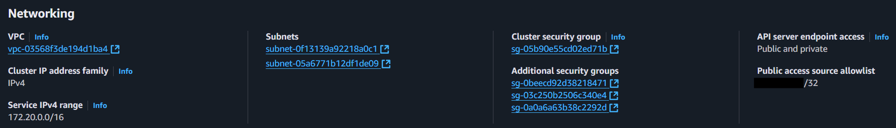

### Cluster EKS (module terraform-aws-eks)

- Version : 1.33
- Add-ons managés :
  - CoreDNS
  - kube-proxy
  - vpc-cni
  - eks-pod-identity-agent
  - aws-ebs-csi-driver
  - aws-efs-csi-driver

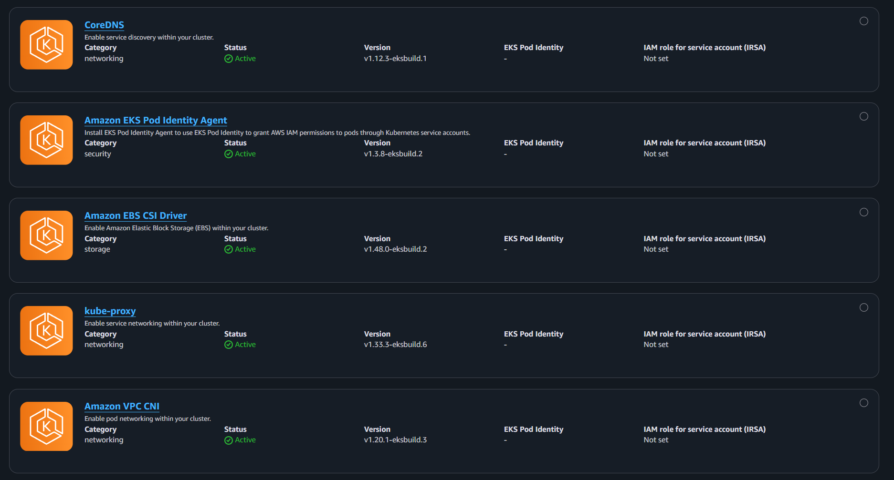

#### Voir les schémas pour addons

```bash
aws eks describe-addon-versions --addon-name kube-proxy
aws eks describe-addon-configuration --addon-name kube-proxy --addon-version v1.33.3-eksbuild.6
```

### Storage Class

2 StorageClass sont disponibles pour couvrir différents use cases :

#### Comparaison EBS vs EFS

| Critère            | **EBS (gp3)**                       | **EFS**                            |
| ------------------ | ----------------------------------- | ---------------------------------- |
| **Type**           | Block Storage                       | File System (NFS)                  |
| **Mode d'accès**   | RWO (ReadWriteOnce)                 | RWX (ReadWriteMany)                |
| **Disponibilité**  | Zonal (1 AZ)                        | Multi-AZ natif                     |
| **Replicas**       | 1 seul                              | N pods simultanés                  |
| **Performance**    | Très haute (latence basse)          | Bonne (latence réseau)             |
| **Chiffrement**    | AWS-managed                         | AWS-managed                        |
| **Backup**         | Via snapshots EBS                   | AWS Backup intégré                 |
| **Coût**           | ~0.10 $/Gi/mois                     | ~0.30 $/Gi/mois (IA: 0.025 $/Gi)   |
| **Use cases**      | DB, Cache, Apps stateful unireplica | HPA + persistance, partage données |
| **Volume Binding** | WaitForFirstConsumer                | WaitForFirstConsumer               |

> **Note coûts EFS** : Standard (~0.30 $/Gi) pour l'accès fréquent. Les données non accédées pendant 30 jours basculent automatiquement en Infrequent Access (~0.025 $/Gi/mois), réduisant les coûts de stockage long terme.

#### StorageClass EBS (gp3) - Défaut

- **IOPS** : 3000 (jusqu'à 16000)
- **Throughput** : 125 MB/s (jusqu'à 1000)
- **Encryption** : Activée
- **Idéal pour** : PostgreSQL, Redis, applications haute perf

#### StorageClass EFS

- **Throughput Mode** : Elastic (auto-scaling)
- **Encryption** : AWS-managed key
- **Multi-AZ** : Mount targets dans toutes les AZ
- **Access Points** : Isolation sécurisée (POSIX permissions)
- **Idéal pour** : HPA avec persistance, données partagées, uploads

> _Voir [STORAGE_GUIDE.md](terraform/STORAGE_GUIDE.md) pour des exemples d'utilisation détaillés_

### EKS Pod Identity (module terraform-aws-eks-pod-identity)

Fonctionnement : Mapping IAM ↔️ Pod via un agent natif pour l'accès aux services AWS depuis un pod (remplacement moderne de IRSA, plus besoin de gérer OIDC / trust policy)

> _Le ServiceAccount sera la cible de l’association IAM via le module pod-identity — pas besoin d’annotation lorsqu'on utilise EKS Pod Identity._

> _Note: L'association Pod Identity peut être créée AVANT le ServiceAccount, ce qui facilite l'automatisation. voir [doc](https://docs.aws.amazon.com/eks/latest/userguide/pod-id-association.html)_

- AWS EBS/EFS CSI Driver
- AWS Load Balancer Controller
- External DNS
- Cert Manager
- Cert Manager Sync
- SecureCodeBox
- External Secret

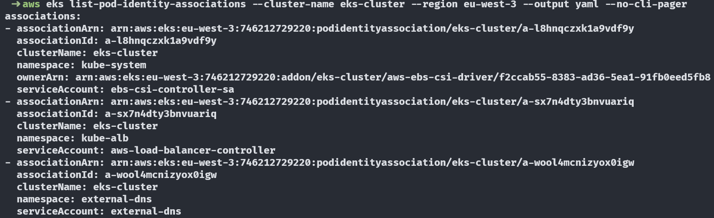

> _Pour EBS/EFS CSI Driver, c'est géré directement dans la partie addons du module EKS_

---

## Bootstrap ArgoCD

- Repo git de configuration dédié : `portfolio-ultime-config`
- Multi-sources utilisés dans les apps ArgoCD afin de référencer des values locales pour une chart helm distante

  > _Il faut éviter d'utiliser multi-sources pour d'autres cas de figure_

### ArgoCD - Déploiement

- Installation d'ArgoCD via chart Helm
- Déploiement des applications ArgoCD via la stratégie App-of-apps

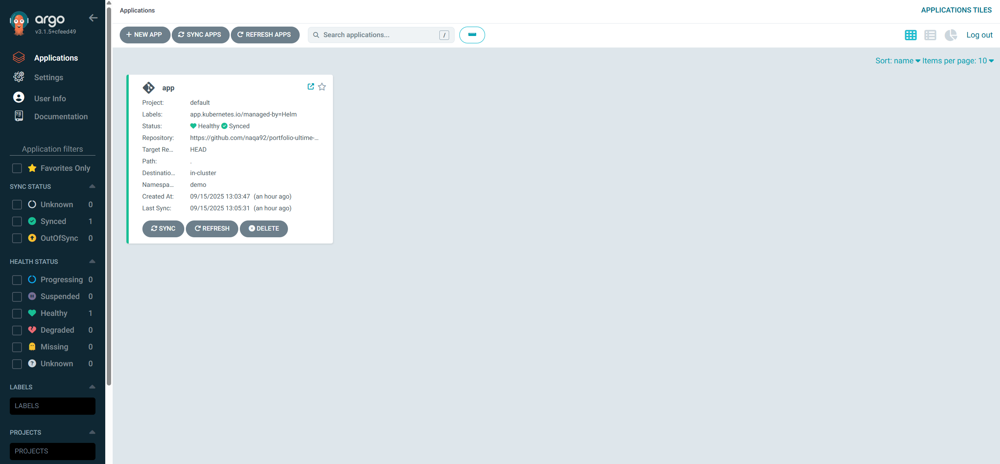

### AWS Load Balancer Controller

#### Architecture de flux

`Client (Internet) → Internet Gateway (IGW) → ALB (L7) → Target Group (Pod IPs) → VPC Routing + Node ENI → Pod (dans le VPC)`

1. **Internet → ALB (Layer 7)**

- Un client externe envoie une requête HTTP/HTTPS.
- Le trafic entre par l’Internet Gateway (IGW), éventuellement via Route 53/DNS vers l’ALB.
- L’ALB termine la connexion TLS (si configurée) et effectue le routage applicatif.

2. **ALB → Target Groups (Pod IPs)**

- L’ALB cible directement les IPs des Pods enregistrées dans un Target Group (grâce au VPC CNI).
- Chaque Pod possède une IP VPC native, permettant un routage direct comme pour des instances EC2.

3. **Target Group → VPC / Node ENI**

- L’ALB envoie le trafic vers l’IP du Pod sélectionné.
- Le paquet traverse le réseau interne du VPC.
- Si le Pod est sur un Node, l’ENI du Node est utilisée pour délivrer le paquet.

4. **Node ENI → Pod**

- Le Node connaît le mapping entre l’IP du Pod et son espace réseau interne via l’ENI assignée.
- Le trafic est remis directement au Pod, sans passer par kube-proxy (routage L3 direct).

**Résultat :** latence faible, performance quasi native.

#### Values helm

- `defaultTargetType = "ip"` : Instance par défaut. Avec IP, Le trafic est directement routé vers les adresses IP des pods. La valeur IP est recommandée pour une meilleure intégration et performance avec la CNI Amazon VPC.
- `deregistration_delay = 120s` : Valeur fixe pour synchroniser la durée avec `terminationGracePeriodSeconds` du pod pour éviter les coupures de sessions pendant les déploiements
- `vpcTags` : Nom du cluster pour récupérer vpcID automatiquement

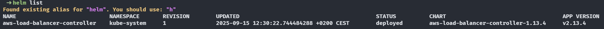

> _à configurer côté pod : terminationGracePeriodSeconds + ReadinessProbes_

### External DNS

Gestion automatique des enregistrements DNS Route 53

Annotation de l'ingress à ajouter pour créer une entrée de type A automatiquement :

```yaml
external-dns.alpha.kubernetes.io/hostname: app.ndebaa.com
```

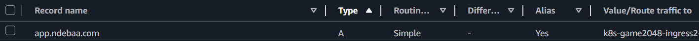

### Cert Manager

Solver DNS-01 avec Route53 utilisé pour une meilleure intégration.

Avantages par rapport au solver HTTP-01 :

- ✅ Plus robuste : Pas de dépendance sur la résolution DNS interne du cluster
- ✅ Simplicité : cert-manager vérifie directement via l'API Route53
- ✅ Compatible avec l'infrastructure : external-dns avec permissions Route53
- ✅ Wildcards supportés si besoin
- ✅ Production-ready : Solution standard pour les clusters privés

Certificat cert-manager :


#### Cert Manager Sync

- **Projet** : [cert-manager-sync](https://github.com/robertlestak/cert-manager-sync)
- **Contexte** : ALB Controller n’utilise pas automatiquement les secrets TLS générés par cert-manager pour créer un listener HTTPS sur l’ALB car il attend un ARN ACM (annotation `alb.ingress.kubernetes.io/certificate-arn`)
- **Fonctionnement** :
  - Écoute les Issuers/Certificates cert-manager.
  - Crée automatiquement un certificat dans ACM.
  - Synchronise l’ARN ACM dans les annotations du Secret Kubernetes.

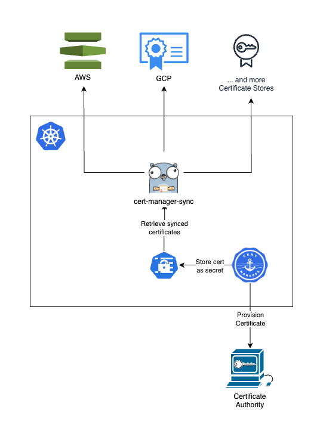

Annotation de l'ingress à ajouter pour transmettre un secretTemplate au Certificat auto-généré :

```yaml
cert-manager.io/secret-template: |
  {"annotations": {"cert-manager-sync.lestak.sh/sync-enabled":"true", "cert-manager-sync.lestak.sh/acm-enabled":"true", "cert-manager-sync.lestak.sh/acm-region": "eu-west-1"}}
```

Certificat ACM :

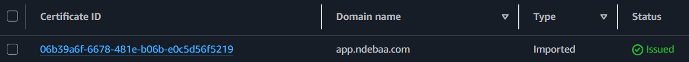

### CNPG (PostgreSQL)

Cluster PostgreSQL pour l'application todolist via l'opérateur CNPG (1 primaire et 1 secondaire)

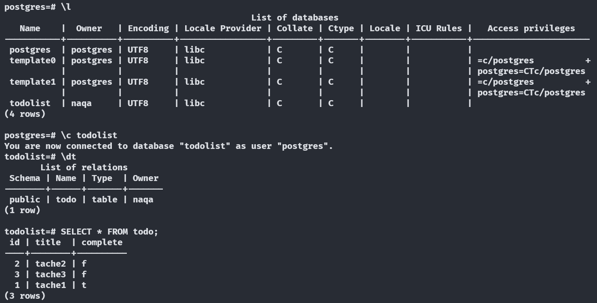

### KubeScape (Test sécurité)

Outil open-source de sécurité et de conformité pour Kubernetes qui analyse les configurations, détecte les vulnérabilités et applique les bonnes pratiques dans les clusters et les manifests.

Dashboard utilisé : Headlamp (via plugin)

### Headlamp

Headlamp est une interface graphique moderne pour Kubernetes, facilitant la gestion et la visualisation des ressources du cluster. Dans ce projet, Headlamp est enrichi avec le plugin Kubescape, permettant d'intégrer directement les résultats d'analyse de sécurité et de conformité dans le dashboard. Grâce à ce plugin, il est possible de visualiser les rapports de scans Kubescape, d'identifier rapidement les vulnérabilités et de suivre l'état de conformité du cluster depuis une seule interface centralisée.

- Token d'accès nécessaire : `kubectl create token headlamp --namespace kube-system`
- Accès local : `kubectl port-forward -n kube-system service/headlamp 8080:80`

Compliance du framework cis-eks-t1.2.0 :

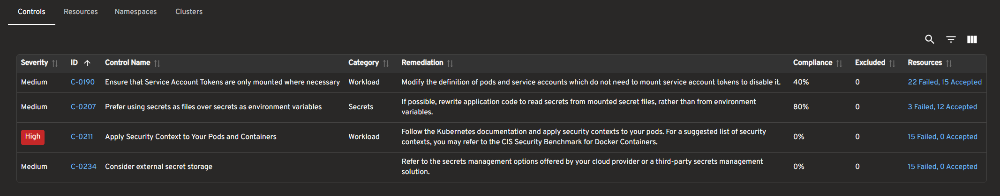

> [Doc in-cluster](https://headlamp.dev/docs/latest/installation/in-cluster/)

### secureCodeBox (DAST)

Outil d'analyse de sécurité automatisée (DAST) : secureCodeBox est un projet OWASP qui propose une solution open source automatisée et évolutive, intégrant plusieurs scanners de sécurité via une interface simple et légère — pour des tests de sécurité continus et automatisés.

#### Fonctionnement :

- Opérateur avec authentification s3 configurée
- Chart Helm `zap-automation-framework` installé dans le namespace de l'application à scanner
- Auto-Discovery avec scans automatisés + upload vers bucket S3.

Un scan va lancer 2 jobs :

- Job scan : Permet de générer zap-results.xml sur le bucket S3
- Job parse : Permet de générer findings.json sur le bucket S3 (format unifié et structuré de zap-results.xml)

#### Auto-Discovery

Pré-requis :

- Annotation sur le namespace demo `auto-discovery.securecodebox.io/enabled=true`
- Service nommé http/https pour la détection automatique

Values :

- `repeatInterval` : Le scan est déclenché immédiatement et le compteur de 168h (7 jours) est réinitialisé. Si aucun déploiement n'a lieu pendant 168h, le scan est déclenché automatiquement à l'expiration du délai.
- `env` : Supporte le templating si besoin

> _Nécessite un environnement dédié aux tests pour du scanning actif_

> _Documentation : [Auto-Discovery](https://www.securecodebox.io/docs/auto-discovery/service-auto-discovery/) / [default values](https://github.com/secureCodeBox/secureCodeBox/blob/main/auto-discovery/kubernetes/README.md)_

#### Test d'un scan manuel

```yaml
apiVersion: execution.securecodebox.io/v1
kind: Scan
metadata:
  name: zap-manual-test
  namespace: demo
spec:
  scanType: "zap-automation-framework"
  env:
    - name: TARGET_URL
      value: "http://todolist.demo.svc.cluster.local:5000"
  parameters:
    - "-autorun"
    - "/home/securecodebox/scb-automation/automation.yaml" # MountPath de la ConfigMap auto-générée (valeur par défaut)
  volumeMounts:
    - name: zap-config
      mountPath: /home/securecodebox/scb-automation/automation.yaml
      subPath: automation.yaml
  volumes:
    - name: zap-config
      configMap:
        name: zap-automation-framework-baseline-config # ConfigMap auto-générée
```

#### Rapports uploadé vers bucket S3

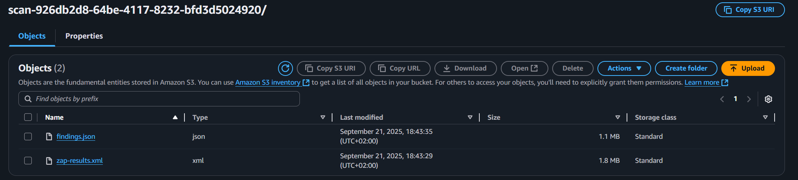

#### Résultat d'un rapport (Scanning DAST passif)

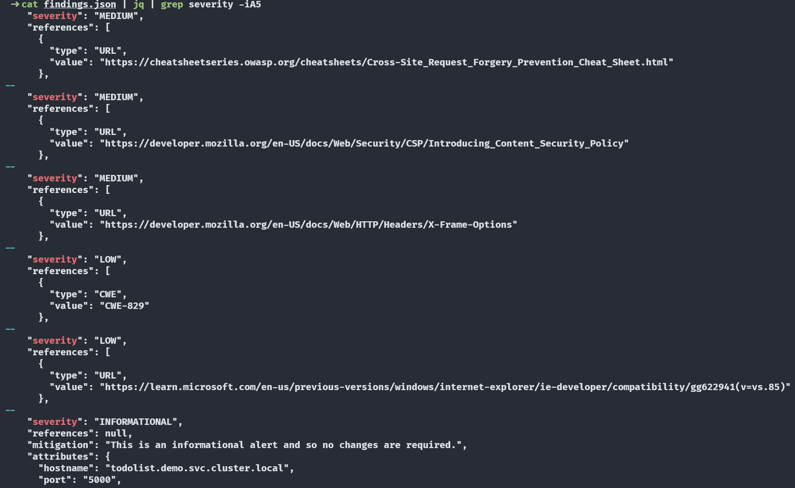

### External Secret Operator (ESO)

ESO permet de garder les secrets en dehors de git. L'opérateur surveille en continu les secrets afin de les synchroniser sur Kubernetes.

Fonctionnement :

- Récupère les secrets depuis un store (ex: AWS Secret Manager)
- Les convertit en secrets Kubernetes standard

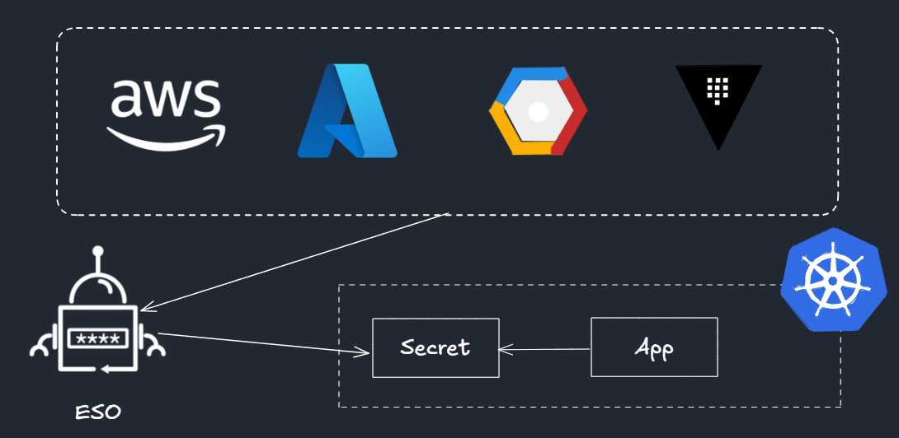

Dans ce projet, le secret nécessaire se nomme `ghcr-token`. Il permet de récupérer les packages ghcr.io (Helm + Image Docker)

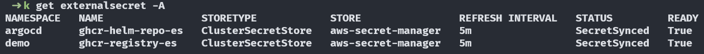

> _Note: Statut OutOfSync dans ArgoCD dû au paramètre refreshInterval, mais les secrets sont bien présents et fonctionnels_

---

## Pipeline dédiée à Terraform

| Action                          | Format check | Init | Validate | Plan | Apply | Destroy |
| ------------------------------- | :----------: | :--: | :------: | :--: | :---: | :-----: |
| **Push**                        |      ✅      |  ✅  |    ✅    |  ✅  |  ✅   |   ❌    |
| **Workflow dispatch - plan**    |      ✅      |  ✅  |    ✅    |  ✅  |  ❌   |   ❌    |
| **Workflow dispatch - apply**   |      ✅      |  ✅  |    ✅    |  ✅  |  ✅   |   ❌    |
| **Workflow dispatch - destroy** |      ✅      |  ✅  |    ✅    |  ❌  |  ❌   |   ✅    |

---

## Licence

Ce projet est sous licence MIT

---

## TODO

- Terraform :

  - Destroy :
    - Gérer load balancer, route53, ACM et VPC (finalizers)
    - Sécurité du dispatch destroy
  - Passer d'ALB Controller à Gateway Controller
  - Secret manager pour la synchronisation du repo `portfolio-ultime-config` en privé

- ArgoCD :

  - Rendered manifests pattern : [argocd-diff-preview](https://github.com/dag-andersen/argocd-diff-preview)
  - Réorganisation du repo `portfolio-ultime-config` : structure
  - Déploiements :
    - Argo Rollouts
    - Argo Image Updater
    - Observabilité (avec Metrics server)
    - Headlamp (UI pour Kubescape) : [Intégration avec Cognito](https://headlamp.dev/docs/latest/installation/in-cluster/eks/) (équivalent de Keycloak)
    - Securecodebox (DAST) :
      - Hooks pour extraire les résultats (findings) et les envoyer vers des systèmes externes (DefectDojo, Slack, Email, Dashboards grafana, Lambda, jobs CI...)
      - Scanning actif avec envs éphémères : PR Generator (+Vcluster?)

- EKS Production ready :

  - Au moins 3 nodes
  - Au moins 3 AZ
  - Access Entries : Mapping IAM ↔️ utilisateurs Kubernetes automatisé pour gérer plus finement les permissions d'accès au cluster (remplacement moderne de aws-auth)
    - _actuellement `enable_cluster_creator_admin_permissions = true`_
  - Chiffrement EBS/EFS avec KMS (actuellement AWS-managed)
  - Logging control plane
  - Backups : Cluster (Velero) et Database (S3)
  - Branch Protection pour pipeline avec :
    - Distinction entre plan (PR) et apply (merge)
    - Approbation manuelle via environment production
  - CNI : Cillium
  - Auto-scaling : Karpenter
  - Right-sizing : Cast.ai
