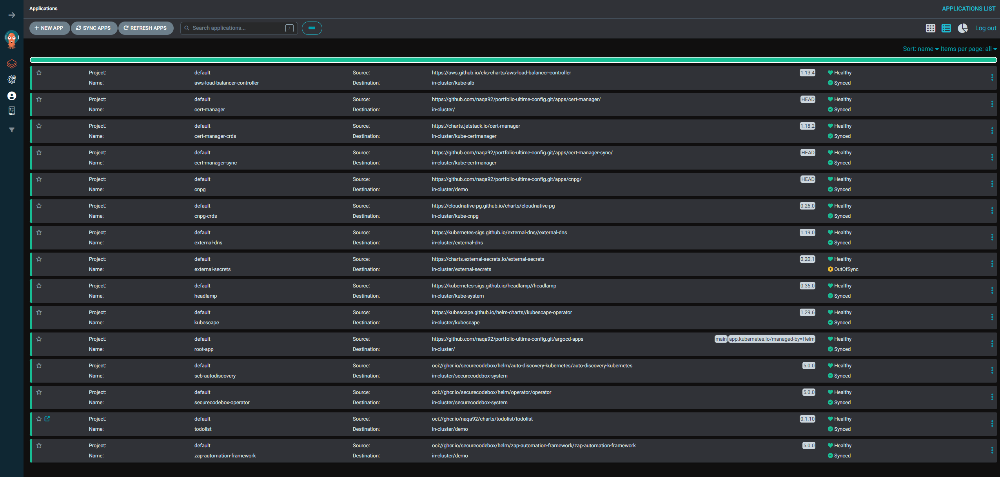
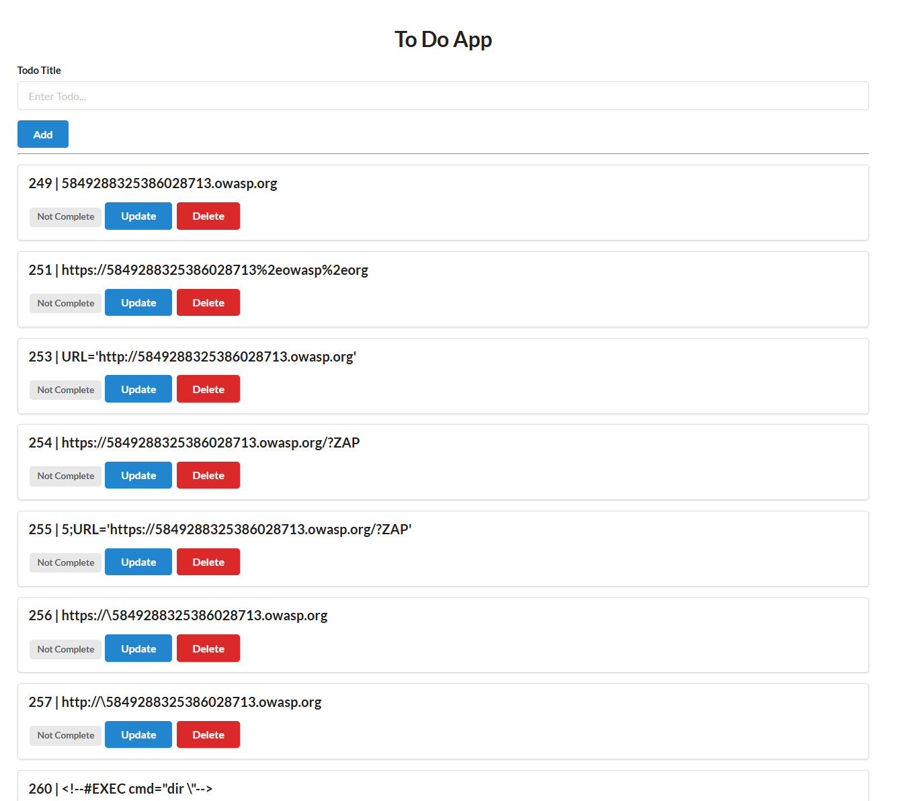

# Cluster EKS avec Terraform

Ce projet utilise GitHub Actions pour automatiser le déploiement d'une infrastructure via Terraform avec :

- Cluster EKS complet via plusieurs modules
- ArgoCD avec boostrap d'applications

---

# Pré-requis

- Terraform >= 1.12.0
- AWS CLI configuré
- Repo git dédié pour ArgoCD : `portfolio-ultime-config`
- Bucket S3 backend : `portfolio-ultime-infra`

```bash
aws s3api create-bucket \
  --bucket portfolio-ultime-infra \
  --region eu-west-3 \
  --create-bucket-configuration LocationConstraint=eu-west-3
```

> _Pour supprimer le bucket S3 : `aws s3 rb s3://portfolio-ultime-infra --force`_

- Définir les secrets du repo

| Secret                  | Description     |
| ----------------------- | --------------- |
| `AWS_ACCESS_KEY_ID`     | Clé d'accès AWS |
| `AWS_SECRET_ACCESS_KEY` | Clé secrète AWS |

Terraform

- `allowed_ips` : Adresse IP personnelle en /32
- `external_dns_hosted_zone_arns` : Hosted Zone ID (Route53)

---

# 📁 Structure du projet

```
portfolio-ultime-infra/
├── .github/workflows/
│   └── terraform.yml           # Pipeline CI/CD
├── terraform/
│   ├── eks.tf                  # Configuration EKS
│   ├── helm-charts.tf          # Charts Helm
│   ├── pod-identity.tf         # Pod Identity
│   ├── providers.tf            # Providers Terraform
│   ├── variables.tf            # Variables
│   ├── vpc.tf                  # Configuration VPC
└── README.md
```

---

# Cluster EKS complet

## Kubeconfig

```bash
aws eks --region eu-west-3 update-kubeconfig --name eks-cluster
```

## Backend S3

Bucket S3 `portfolio-ultime-infra` avec `use_lockfile = true` (plus besoin de DynamoDB pour le verrouillage)


## Infrastructure réseau (modules terraform-aws-vpc et terraform-aws-security-group)

- VPC (10.0.0.0/16) avec support DNS : Emplacement logique pour créer les réseaux
  ├── Subnets privés: 10.0.0.0/19, 10.0.32.0/19
  ├── Subnets publics: 10.0.64.0/19, 10.0.96.0/19
  └── Pods: gérés par VPC CNI dans les subnets

> _Subnets multi-AZ (eu-west-3a et 3b)_

- Services K8S: 10.100.0.0/16
- NAT Gateway et Internet Gateway (création automatique via enable_nat_gateway)
  - NAT : Permet aux instances dans les réseaux privés d'accéder au réseau public
  - Internet : Permet au réseau public d'accéder à Internet
- Tables de routage
  - Pour les subnets publics : Une route vers l'Internet Gateway est automatiquement ajoutée.
  - Pour les subnets privés : Une route vers le NAT Gateway est automatiquement ajoutée.
- 3 Groupes de sécurité : cluster, nodes et load balancer


## Cluster EKS (module terraform-aws-eks)

- Version : 1.33
- Add-ons managés :
  - CoreDNS
  - kube-proxy
  - vpc-cni
  - eks-pod-identity-agent
  - aws-ebs-csi-driver


### Voir les schémas pour addons

```bash
aws eks describe-addon-versions --addon-name kube-proxy
aws eks describe-addon-configuration --addon-name kube-proxy --addon-version v1.33.3-eksbuild.6
```

## EKS Pod Identity (module terraform-aws-eks-pod-identity)

Fonctionnement : Mapping IAM ↔️ Pod via un agent natif pour l'accès aux services AWS depuis un pod (remplacement moderne de IRSA, plus besoin de gérer l'OIDC / trust policy)

> _Le ServiceAccount sera la cible de l’association IAM via le module pod-identity — pas besoin d’annotation via EKS Pod Identity._

> _Note: L'association Pod Identity peut être créée AVANT le ServiceAccount, ce qui facilite l'automatisation. voir [doc](https://docs.aws.amazon.com/eks/latest/userguide/pod-id-association.html)_

- AWS EBS CSI Driver (sans KMS car optionnel)
- AWS Load Balancer Controller
- External DNS
- Cert Manager
- Cert Manager Sync


> _Pour EBS CSI Driver, c'est géré directement dans la partie addons du module EKS_

## Composants additionnels

- AWS Load Balancer Controller (via Helm)


### AWS Load Balancer Controller - Architecture de flux

Internet → ALB (L7) → Target groups (pod IPs) → Réseau VPC / Node ENI → Pods

### AWS Load Balancer Controller - Values helm

- `defaultTargetType = "ip"` : Instance par défaut. Avec IP, Le trafic est directement routé vers les adresses IP des pods. La valeur IP est recommandée pour une meilleure intégration et performance avec la CNI Amazon VPC.
- `deregistration_delay = 120s` : Valeur fixe pour synchroniser la durée avec `terminationGracePeriodSeconds` du pod pour éviter les coupures de sessions pendant les déploiements
- `vpcTags` : Nom du cluster pour récupérer vpcID automatiquement

> _à configurer côté pod : terminationGracePeriodSeconds + ReadinessProbes_

# Bootstrap ArgoCD

## Déploiement

- Installation d'ArgoCD via chart Helm
- Déploiement des applications ArgoCD via la stratégie App-of-apps



## External DNS

Gestion automatique des enregistrements DNS Route 53

Annotation de l'ingress à ajouter pour créer une entrée de type A automatiquement :

```yaml
external-dns.alpha.kubernetes.io/hostname: app.ndebaa.com
```


## Cert Manager

Solver DNS-01 avec Route53 utilisé pour une meilleure intégration.

Avantages par rapport au solver HTTP-01 :

- ✅ Plus robuste : Pas de dépendance sur la résolution DNS interne du cluster
- ✅ Simplicité : cert-manager vérifie directement via l'API Route53
- ✅ Compatible avec l'infrastructure : external-dns avec permissions Route53
- ✅ Wildcards supportés si besoin
- ✅ Production-ready : Solution standard pour les clusters privés

## Cert Manager Sync

- **Projet** : [cert-manager-sync](https://github.com/robertlestak/cert-manager-sync)
- **Contexte** : ALB Controller n’utilise pas automatiquement les secrets TLS générés par cert-manager pour créer un listener HTTPS sur l’ALB car il attend un ARN ACM (annotation `alb.ingress.kubernetes.io/certificate-arn`)
- **Fonctionnement** :
  - Écoute les Issuers/Certificates cert-manager.
  - Crée automatiquement un certificat dans ACM.
  - Synchronise l’ARN ACM dans les annotations du Secret Kubernetes.


Annotation de l'ingress à ajouter pour transmettre un secretTemplate au Certificat auto-généré :

```yaml
cert-manager.io/secret-template: |
  {"annotations": {"cert-manager-sync.lestak.sh/sync-enabled":"true", "cert-manager-sync.lestak.sh/acm-enabled":"true", "cert-manager-sync.lestak.sh/acm-region": "eu-west-1"}}
```

Certificat cert-manager :


Certificat ACM :


## CNPG

Cluster PostgreSQL pour l'application todolist via l'opérateur CNPG (1 primaire et 1 secondaire)

## KubeScape

Outil open-source de sécurité et de conformité pour Kubernetes qui analyse les configurations, détecte les vulnérabilités et applique les bonnes pratiques dans les clusters et les manifests.

Dashboard utilisé : Headlamp (via plugin)

## secureCodeBox

Outil d'analyse de sécurité automatisée (DAST) :

- Définition : secureCodeBox est un projet OWASP qui propose une solution open source automatisée et évolutive, intégrant plusieurs scanners de sécurité via une interface simple et légère — pour des tests de sécurité continus et automatisés.
- Fonctionnement :
  - Opérateur avec authentification s3 configurée
  - Chart Helm `zap-automation-framework` installé dans le namespace de l'application à scanner (ns:demo, app:todolist)
  - Auto-Discovery avec scans automatisés (ScheduledScan) + upload vers bucket S3.

Un scan va lancer 2 jobs :

- Job scan : Permet de générer zap-results.xml sur le bucket S3
- Job parse : Permet de générer findings.json sur le bucket S3

> _Note: Annotation sur le namespace demo `auto-discovery.securecodebox.io/enabled=true` nécessaire pour activer l'auto-discovery_

> [Doc Auto-Discovery](https://www.securecodebox.io/docs/auto-discovery/service-auto-discovery/)

### Test d'un scan manuel

```yaml
apiVersion: execution.securecodebox.io/v1
kind: Scan
metadata:
  name: zap-manual-test
  namespace: demo
spec:
  scanType: "zap-automation-framework"
  env:
    - name: TARGET_URL
      value: "http://todolist.demo.svc.cluster.local:5000"
  parameters:
    - "-autorun"
    - "/home/securecodebox/scb-automation/automation.yaml"
  volumeMounts:
    - name: zap-config
      mountPath: /home/securecodebox/scb-automation/automation.yaml
      subPath: automation.yaml
  volumes:
    - name: zap-config
      configMap:
        name: zap-automation-framework-baseline-config
```

> _Mount de la configmap zap-automation-framework-baseline-config auto-générée_

### Payloads de test d’intrusion (injection, XSS, SSRF, etc.) tentés par ZAP



### Rapports uploadé vers bucket S3


---

# Pipeline dédiée à Terraform

## Fonctionnement du Workflow Dispatch

| Action                          | Format check | Init | Validate | Plan | Apply | Destroy |
| ------------------------------- | :----------: | :--: | :------: | :--: | :---: | :-----: |
| **Push**                        |      ✅      |  ✅  |    ✅    |  ✅  |  ✅   |   ❌    |
| **Workflow dispatch - plan**    |      ✅      |  ✅  |    ✅    |  ✅  |  ❌   |   ❌    |
| **Workflow dispatch - apply**   |      ✅      |  ✅  |    ✅    |  ✅  |  ✅   |   ❌    |
| **Workflow dispatch - destroy** |      ✅      |  ✅  |    ✅    |  ❌  |  ❌   |   ✅    |

---

## TODO

- Terraform :

  - Destroy : Gérer load balancer, route53 et ACM
  - Passer d'ALB Controller à Gateway Controller

- ArgoCD :

  - Secret manager pour la synchronisation du repo `portfolio-ultime-config` en privé
  - Rendered manifests pattern
  - Réorganisation du repo `portfolio-ultime-config` : structure, targetRevisions et référence des values
  - Déploiements :
    - Argo Rollouts
    - Observabilité (avec Metrics server)

- EKS Production ready :

  - Au moins 3 nodes
  - Au moins 3 AZ
  - Access Entries : Mapping IAM ↔️ utilisateurs Kubernetes automatisé pour gérer plus finement les permissions d'accès au cluster (remplacement moderne de aws-auth)
    - _actuellement `enable_cluster_creator_admin_permissions = true`_
  - Chiffrement EBS via `encryption_config` (KMS)
  - Logging control plane
  - Backups : Cluster (Velero) et Database (S3)
  - Branch Protection pour pipeline avec :
    - Distinction entre plan (PR) et apply (merge)
    - Approbation manuelle via environment production
  - CNI : Cillium
  - Auto-scaling : Auto-Scaler (simple) / Karpenter (avancé)
